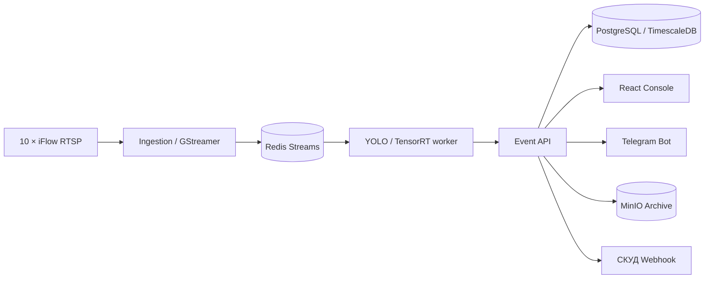

# Архитектура

Текущий MVP объединяет control-plane в одном FastAPI-процессе и использует SQLite, чтобы запускаться одной командой. Границы API соответствуют будущим сервисам. В production inference отделяется в GPU worker, кадры передаются через Redis Streams, метаданные — PostgreSQL, архив — MinIO.

## Целевые показатели эксплуатации
- 10 одновременных потоков по 5–10 FPS.
- Latency события < 2 секунд.
- Precision ≥ 90%, Recall ≥ 85% — проверяются на размеченном наборе площадки, а не гарантируются кодом.
- Работа без внешнего интернета; секреты и видеоданные остаются on-premise.
